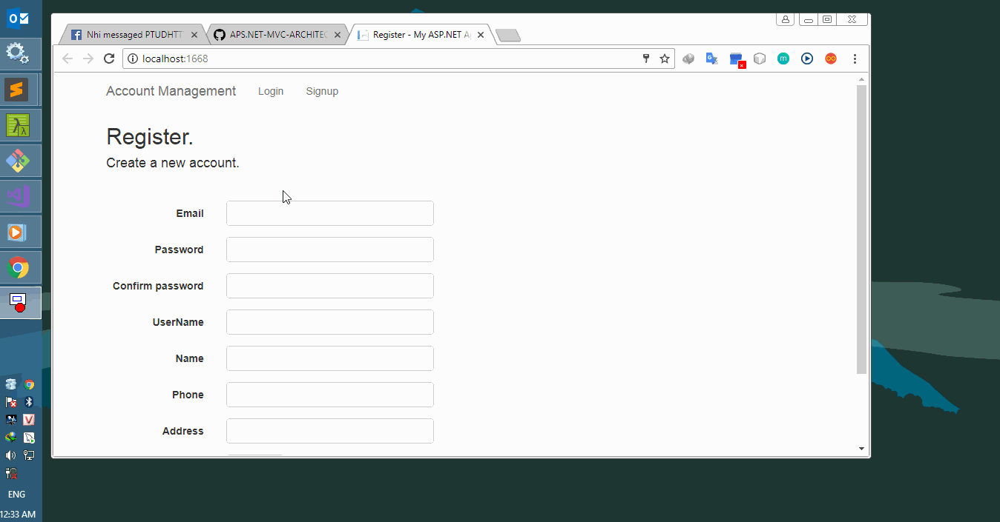

# BT-HTTTDH-1 - *aps.net architecture*

**UserManagement**. Ứng dụng cho phép người dùng đăng kí tài khoản và xem thông tin đăng kí.

Thành viên tham gia:
* [X] **1312404** Thái Quỳnh Nhi
* [X] **1312213** Nguyễn Duy Hoàng 
* [X] **1312454** Phạm Quốc Hoàng 

Yêu cầu
* [X] Áp dụng mô hình MVC
* [X] Áp dụng nguyên lí SOLID
* [X] Sử dụng Nlog
* [X] Áp dụng Exceptions-Errors Handling

## Demo

Link ảnh GIF demo ứng dụng:

